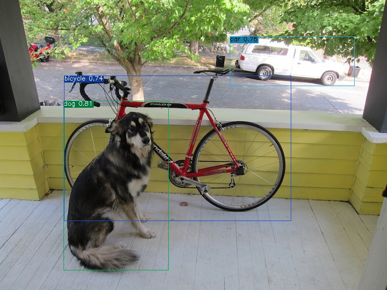

<div align="center">
<h1>
  MiniDet: A Lightweight and Efficient Object Detection Framework
</h1>

<h4>
    
</h4>
</div>

## <div align="center">Overview</div>

This repo is a PyTorch implementation of FastestDet, a lightweight and efficient object detection framework. MiniDet is also a good example for beginners to learn how to implement a modern object detection framework.

### Installation

```
git clone https://github.com/kadirnar/minidet
cd yolov5-strongsort
pip install -r requirements.txt
```

### Inference
```

```
### Evaluation
```

```
### Training
```

```


## Citations
```bibtex
@misc{=FastestDet,
      title={FastestDet: Ultra lightweight anchor-free real-time object detection algorithm.},
      author={xuehao.ma},
      howpublished = {\url{https://github.com/dog-qiuqiu/FastestDet}},
      year={2022}
}
```

### Reference:
 - [FastestDet](https://github.com/dog-qiuqiu/FastestDet)
